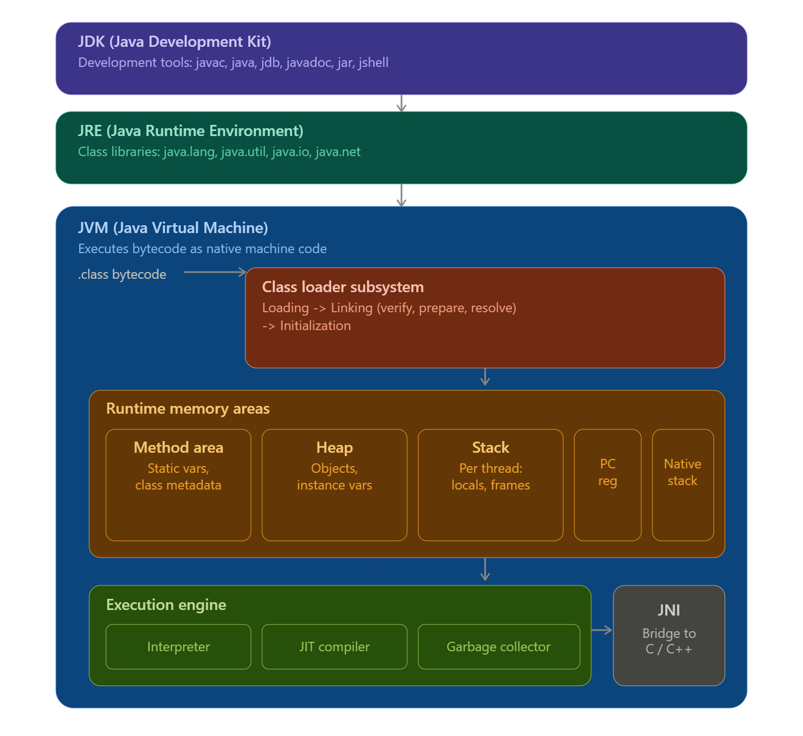

# Day 1 — JDK, JRE, JVM Architecture
## Today I started with JDK, JRE, and JVM architecture.

JDK = Development Tools + JRE
JDK (Java Development Kit)
│
├── Development Tools
│  javac (compiler), java (launcher), javadoc, jar, jdb, jshell, jlink, jmod
│
└── JRE (Java Runtime Environment)
   │
   ├── JVM (Java Virtual Machine)
   └── Java Class Libraries (java.lang, java.util, java.io, java.net, ...)

JDK → used by developers to write and compile code.
JRE → used by end users/clients to run compiled .class files.
JVM → the engine inside the JRE that actually executes bytecode.

Flow: Java source (.java) → javac → bytecode (.class) → JVM → executed as native machine code

## JVM Internal Architecture
1. Class Loader Subsystem
Loads .class files into the JVM in three stages:
Loading —>reads the .class file (via Bootstrap, Platform, and Application class loaders, in that hierarchy)
Linking Verification —> checks bytecode is safe and structurally valid
Preparation —> allocates memory for static variables, sets default values
Resolution —> resolves symbolic references to actual memory addresses
Initialization —> runs static blocks, assigns real values to static variables

2. Runtime Data Areas (Memory)
| Area               | Scope       | stores
|--------------------|------------ |--------------------------------------------------   |
| Method Area        | Shared      | Class metadata, static variables, constant pool     |
| Heap               | Shared      | All objects and instance variables                  |
| Stack              |  Per-thread | Local variables, method call frames                 |
| PC Register        | Per-thread  | Address of the currently executing instruction      |
| Native Method Stack| Per-thread  | Support for native (C/C++) method calls             |

3. Execution Engine
Interpreter — executes bytecode line by line
JIT Compiler — compiles frequently-used ("hot") methods into native machine code once, so repeated calls run fast without re-interpreting
Garbage Collector — automatically frees heap memory occupied by unreachable objects

4. Native Interface
JNI (Java Native Interface) — bridges Java code to native libraries written in C/C++

## key diagram 

